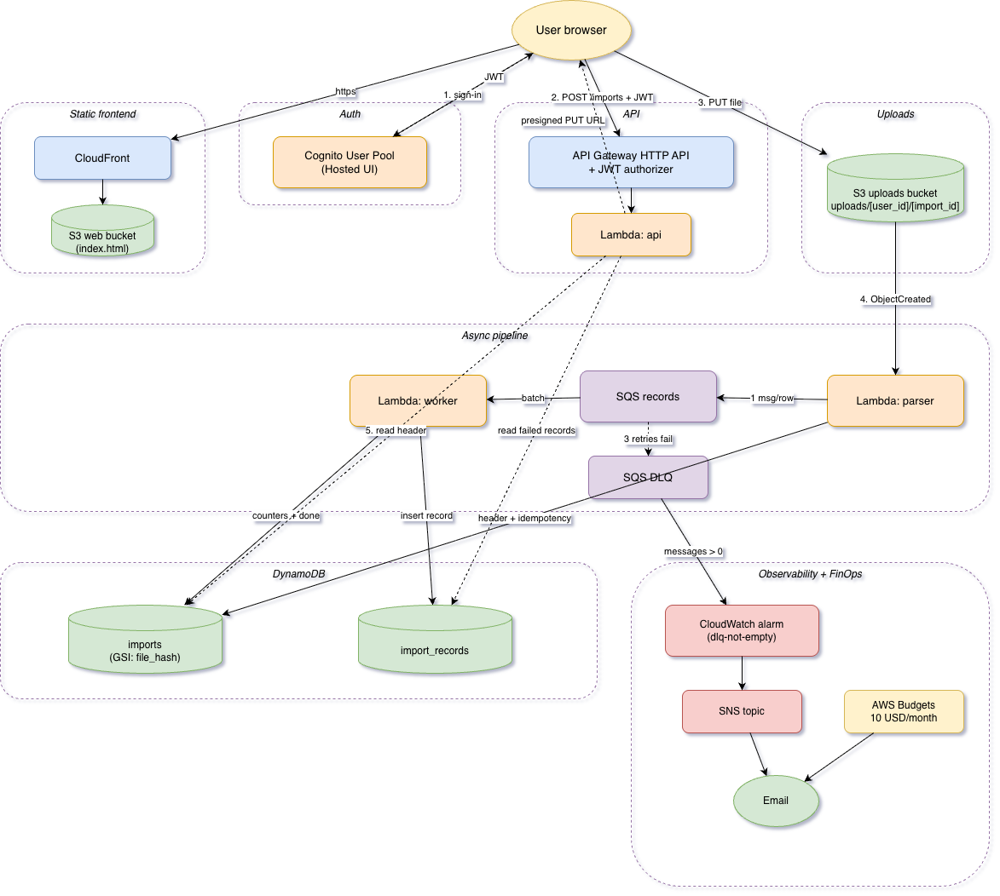

# bulk-import-aws

**Serverless bulk CSV ingestion on AWS — asynchronous pipeline, idempotent, deployed with Terraform.**

Users upload a CSV of products via a presigned URL. The backend parses it
off-request, validates each row and exposes a per-import report with the
rows that succeeded and the ones that failed with their reason.

The stack is fully serverless and event-driven: S3 + Lambda + SQS + DynamoDB
for the pipeline, Cognito + API Gateway for the API, CloudFront for the
static frontend. Everything is defined as Terraform.

## Architecture



The flow of one import:

1. A signed-in user calls `POST /imports`. The `api` Lambda generates an
   `importId` and a presigned PUT URL.
2. The browser PUTs the file to `s3://<bucket>/uploads/<user_id>/<import_id>`.
3. The S3 `ObjectCreated` event triggers the `parser` Lambda. It computes a
   SHA-256 of the file, checks the `file_hash` GSI on the `imports` table
   for idempotency, writes the import header with `total=N` and publishes
   one SQS message per row.
4. The `worker` Lambda consumes the queue in batches, validates each row
   (`sku` non-empty, `name` non-empty, `price > 0`), persists the result
   into `import_records` and increments the `succeeded` or `failed`
   counter on the import header. When the sum reaches `total`, a
   conditional update marks the import as `done`.
5. Records that fail to persist after three retries land on the DLQ. A
   CloudWatch alarm publishes to SNS, which delivers an email.

See `docs/adr-0001-event-driven-serverless.md` for the rationale of the
stack and the alternatives that were evaluated.

## Lab account constraints

The project deploys against a sandbox AWS account (AWS Academy / SSO) with
restricted IAM: roles, users and OIDC providers cannot be created. Two
adaptations follow from that:

- All Lambdas share `studentLambdaExecutionRole`, the role pre-provisioned
  in the lab. S3 access is granted from the resource side, via a bucket
  policy on the uploads bucket. In a real account each Lambda would get
  its own role with scoped statements.
- CI runs in GitHub Actions but does not deploy. The workflow only
  validates Terraform (`fmt`, `validate`) and builds the Go binaries.
  `terraform apply` and Lambda package uploads are operated locally with
  the SSO session.

## Deploy

Prerequisites: Terraform >= 1.6, Docker (for the Go cross-compile), AWS
CLI with an active SSO session.

```bash
export AWS_PROFILE=lab-sergio

# one-off: tfstate bucket
cd infra/bootstrap
terraform init
terraform apply
cd ../..

# build Lambda zips
make package

# main stack (infra + code)
make tf-apply

# invalidate the CloudFront cache after frontend changes
make deploy-web
```

The main stack uses the bucket created by the bootstrap as its remote
backend. State locking is handled natively by S3 via `use_lockfile`, so
there is no separate DynamoDB lock table.

After the first `tf-apply` the Terraform outputs print the public URLs:

```bash
cd infra && terraform output
```

To use the app, open the CloudFront URL printed as `cloudfront_domain`,
sign up through the Cognito hosted UI and upload a CSV with header
`sku,name,price`.

## Destroy

```bash
make tf-destroy
```

The main stack tears down cleanly. The bootstrap (tfstate bucket) survives
on purpose so the state of any future run still has a home. To remove it
fully, empty the bucket and `terraform destroy` inside `infra/bootstrap`.

## Cost estimate

Roughly **1-3 EUR/month** with the stack idle, dominated by CloudFront and
DynamoDB minimal usage. With the AWS free tier in place on a fresh
account it stays effectively zero. Active usage (uploading and processing
CSV files) is metered per request and per million Lambda invocations, far
below the free-tier ceilings for any realistic demo workload.

A `bulk-import-aws` AWS Budget caps the project at 10 USD/month with email
notifications at 50%, 80% and 100% of actual spend.

## Proofs

`docs/proofs.md` captures the outputs of the three checks required by the
brief, with the scripts that produced them under `scripts/`:

- per-record validation failures appear in the report with their reason,
- the same file uploaded twice produces a `duplicate_of` header and zero
  re-imports,
- persistence failures are redriven to the DLQ and trip the CloudWatch
  alarm via SNS.

## Repo layout

```
.github/workflows/ci.yml      validate-only pipeline (no aws credentials)
infra/                        main terraform stack (remote state)
infra/bootstrap/              one-off terraform: tfstate bucket
src/{api,parser,worker}/      go lambdas, one module each
web/index.html                templated by terraform at deploy time
samples/                      csvs used by the proof scripts
scripts/                      proof scripts
docs/                         architecture diagram, adr, proof outputs
```
